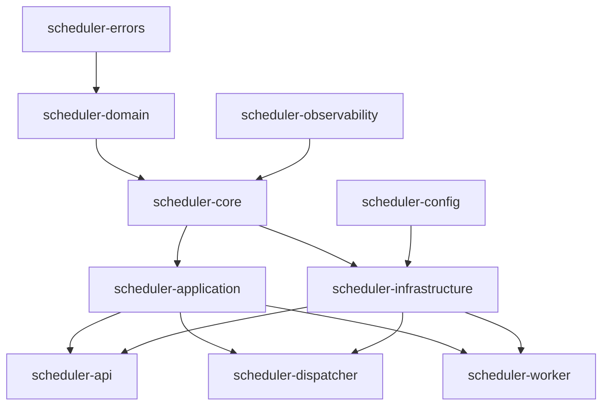

# 开发者指南 - 分布式任务调度系统

## 🎯 开发环境设置

### 系统要求

```bash
# 必需工具
- Rust 1.70+
- PostgreSQL 13+
- RabbitMQ 3.8+
- Docker & Docker Compose
- Git

# 可选工具
- Redis 6.0+ (缓存支持)
- kubectl (Kubernetes部署)
- cargo-watch (自动重建)
```

### 开发环境初始化

```bash
# 1. 克隆项目
git clone <repository-url>
cd scheduler

# 2. 安装Rust工具链
rustup component add rustfmt clippy
cargo install cargo-watch cargo-expand

# 3. 启动开发依赖
docker-compose -f docker-compose.dev.yml up -d

# 4. 环境变量配置
cp .env.example .env
# 编辑 .env 文件设置必要变量

# 5. 数据库初始化
cargo run --bin migrate

# 6. 验证环境
cargo test --all
```

## 🏗️ 项目架构深入解析

### Crate依赖关系图



### 层次架构说明

#### 1. 基础层 (Foundation Layer)
```rust
// scheduler-errors: 统一错误处理
pub enum SchedulerError {
    ValidationError(String),
    DatabaseError(String),
    MessageQueueError(String),
    // ...
}

// scheduler-domain: 业务领域模型
pub struct Task {
    pub id: Option<i64>,
    pub name: String,
    pub executor: String,
    // ...
}

// scheduler-core: 依赖注入和服务抽象
pub struct Container {
    services: HashMap<TypeId, Arc<dyn Any + Send + Sync>>,
}
```

#### 2. 应用层 (Application Layer)
```rust
// scheduler-application: 业务服务实现
#[async_trait]
impl TaskControlService for TaskService {
    async fn create_task(&self, request: CreateTaskRequest) -> SchedulerResult<Task> {
        // 1. 验证输入
        self.validate_task_request(&request)?;
        
        // 2. 业务逻辑处理
        let task = Task::from_request(request);
        
        // 3. 持久化
        self.repository.save(&task).await?;
        
        // 4. 发布事件
        self.event_publisher.publish(TaskCreated { task_id: task.id }).await?;
        
        Ok(task)
    }
}
```

#### 3. 基础设施层 (Infrastructure Layer)
```rust
// scheduler-infrastructure: 具体实现
impl TaskRepository for PostgreSQLTaskRepository {
    async fn save(&self, task: &Task) -> SchedulerResult<Task> {
        let query = sqlx::query!(
            "INSERT INTO tasks (name, executor, command) VALUES ($1, $2, $3) RETURNING id",
            task.name,
            task.executor,
            task.command
        );
        
        let row = query.fetch_one(&self.pool).await
            .map_err(|e| SchedulerError::DatabaseError(e.to_string()))?;
            
        Ok(Task { id: Some(row.id), ..task.clone() })
    }
}
```

## 🔧 核心开发模式

### 1. 依赖注入模式

```rust
// 服务注册
let mut container = Container::new();
container.register::<dyn TaskRepository>(Arc::new(PostgreSQLTaskRepository::new(pool)));
container.register::<dyn MessageQueue>(Arc::new(RabbitMQMessageQueue::new(connection)));

// 服务解析
let task_repo = container.resolve::<dyn TaskRepository>()?;
let message_queue = container.resolve::<dyn MessageQueue>()?;

let task_service = TaskService::new(task_repo, message_queue);
```

### 2. 仓储模式 (Repository Pattern)

```rust
// 抽象接口
#[async_trait]
pub trait TaskRepository: Send + Sync {
    async fn find_by_id(&self, id: i64) -> SchedulerResult<Option<Task>>;
    async fn save(&self, task: &Task) -> SchedulerResult<Task>;
    async fn delete(&self, id: i64) -> SchedulerResult<()>;
}

// 具体实现
pub struct PostgreSQLTaskRepository {
    pool: PgPool,
}

#[async_trait]
impl TaskRepository for PostgreSQLTaskRepository {
    async fn find_by_id(&self, id: i64) -> SchedulerResult<Option<Task>> {
        // 实现细节
    }
}
```

### 3. 事件驱动模式

```rust
// 事件定义
#[derive(Debug, Clone, Serialize, Deserialize)]
pub struct TaskCreated {
    pub task_id: i64,
    pub task_name: String,
    pub created_at: DateTime<Utc>,
}

// 事件发布
pub struct EventPublisher {
    message_queue: Arc<dyn MessageQueue>,
}

impl EventPublisher {
    pub async fn publish<T: Event>(&self, event: T) -> SchedulerResult<()> {
        let message = Message::new(event)?;
        self.message_queue.publish("events", message).await
    }
}

// 事件处理
#[async_trait]
pub trait EventHandler<T: Event>: Send + Sync {
    async fn handle(&self, event: T) -> SchedulerResult<()>;
}
```

## 📊 数据层开发指南

### 数据库迁移

```sql
-- migrations/001_initial_schema.sql
CREATE TABLE tasks (
    id BIGSERIAL PRIMARY KEY,
    name VARCHAR(255) NOT NULL UNIQUE,
    description TEXT,
    task_type VARCHAR(100) NOT NULL,
    executor VARCHAR(100) NOT NULL,
    command TEXT NOT NULL,
    arguments JSONB,
    schedule VARCHAR(255),
    priority VARCHAR(20) DEFAULT 'normal',
    status VARCHAR(20) DEFAULT 'created',
    retry_count INTEGER DEFAULT 0,
    timeout_seconds INTEGER DEFAULT 3600,
    created_at TIMESTAMP WITH TIME ZONE DEFAULT NOW(),
    updated_at TIMESTAMP WITH TIME ZONE DEFAULT NOW(),
    CONSTRAINT valid_priority CHECK (priority IN ('low', 'normal', 'high', 'critical'))
);

-- 索引优化
CREATE INDEX idx_tasks_status ON tasks(status);
CREATE INDEX idx_tasks_priority ON tasks(priority);
CREATE INDEX idx_tasks_schedule ON tasks(schedule) WHERE schedule IS NOT NULL;
```

### 查询构建器

```rust
pub struct TaskQueryBuilder {
    query: String,
    params: Vec<Box<dyn ToSql + Send + Sync>>,
    where_clauses: Vec<String>,
}

impl TaskQueryBuilder {
    pub fn new() -> Self {
        Self {
            query: "SELECT * FROM tasks".to_string(),
            params: Vec::new(),
            where_clauses: Vec::new(),
        }
    }
    
    pub fn with_status(mut self, status: TaskStatus) -> Self {
        self.where_clauses.push(format!("status = ${}", self.params.len() + 1));
        self.params.push(Box::new(status.to_string()));
        self
    }
    
    pub async fn execute<'a, E>(&self, executor: E) -> SchedulerResult<Vec<Task>>
    where
        E: Executor<'a, Database = Postgres>,
    {
        let query = self.build_query();
        let rows = sqlx::query_as::<_, Task>(&query)
            .fetch_all(executor)
            .await?;
        Ok(rows)
    }
}
```

### 数据库连接管理

```rust
pub struct DatabaseManager {
    pool: PgPool,
    config: DatabaseConfig,
}

impl DatabaseManager {
    pub async fn new(config: DatabaseConfig) -> SchedulerResult<Self> {
        let pool = PgPoolOptions::new()
            .max_connections(config.max_connections)
            .min_connections(config.min_connections)
            .acquire_timeout(Duration::from_secs(config.connection_timeout))
            .idle_timeout(Duration::from_secs(config.idle_timeout))
            .connect(&config.url)
            .await?;
            
        Ok(Self { pool, config })
    }
    
    pub async fn health_check(&self) -> SchedulerResult<()> {
        sqlx::query("SELECT 1")
            .fetch_one(&self.pool)
            .await?;
        Ok(())
    }
}
```

## 🚀 API开发指南

### 路由定义

```rust
use axum::{
    routing::{get, post, put, delete},
    Router,
};

pub fn create_routes(state: AppState) -> Router {
    Router::new()
        .route("/health", get(health_check))
        .nest("/api", api_routes())
        .layer(cors_layer())
        .layer(auth_layer())
        .layer(rate_limit_layer())
        .with_state(state)
}

fn api_routes() -> Router<AppState> {
    Router::new()
        .nest("/tasks", task_routes())
        .nest("/workers", worker_routes())
        .nest("/system", system_routes())
}

fn task_routes() -> Router<AppState> {
    Router::new()
        .route("/", get(list_tasks).post(create_task))
        .route("/:id", get(get_task).put(update_task).delete(delete_task))
        .route("/:id/trigger", post(trigger_task))
        .route("/:id/pause", post(pause_task))
        .route("/:id/resume", post(resume_task))
}
```

### 请求处理器实现

```rust
#[derive(Debug, Deserialize)]
pub struct CreateTaskRequest {
    pub name: String,
    pub description: Option<String>,
    pub task_type: String,
    pub executor: String,
    pub command: String,
    pub arguments: Option<Vec<String>>,
    pub schedule: Option<String>,
    pub priority: Option<TaskPriority>,
    pub retry_count: Option<u32>,
    pub timeout_seconds: Option<u32>,
}

pub async fn create_task(
    State(app_state): State<AppState>,
    Json(request): Json<CreateTaskRequest>,
) -> Result<Json<ApiResponse<Task>>, ApiError> {
    // 1. 输入验证
    validate_create_task_request(&request)?;
    
    // 2. 业务逻辑处理
    let task = app_state.task_service
        .create_task(request)
        .await?;
    
    // 3. 响应构建
    Ok(Json(ApiResponse::success(task)))
}

// 错误处理
impl From<SchedulerError> for ApiError {
    fn from(err: SchedulerError) -> Self {
        match err {
            SchedulerError::ValidationError(msg) => ApiError::BadRequest(msg),
            SchedulerError::NotFoundError(msg) => ApiError::NotFound(msg),
            SchedulerError::DatabaseError(_) => ApiError::InternalServerError("数据库错误".to_string()),
            _ => ApiError::InternalServerError("内部服务器错误".to_string()),
        }
    }
}
```

### 中间件开发

```rust
// 认证中间件
pub fn auth_middleware() -> impl Layer<Router> {
    middleware::from_fn(auth_handler)
}

async fn auth_handler(
    headers: HeaderMap,
    request: Request,
    next: Next,
) -> Result<Response, ApiError> {
    // 1. 提取认证信息
    let auth_header = headers.get("Authorization")
        .ok_or_else(|| ApiError::Unauthorized("缺少认证头".to_string()))?;
    
    // 2. 验证令牌
    let token = extract_bearer_token(auth_header)?;
    let claims = validate_jwt_token(&token)?;
    
    // 3. 添加用户上下文
    let mut request = request;
    request.extensions_mut().insert(UserContext::from(claims));
    
    Ok(next.run(request).await)
}

// 速率限制中间件
pub fn rate_limit_middleware() -> impl Layer<Router> {
    ServiceBuilder::new()
        .layer(HandleErrorLayer::new(handle_rate_limit_error))
        .layer(BufferLayer::new(1024))
        .layer(RateLimitLayer::new(100, Duration::from_secs(60)))
}
```

## ⚡ 任务调度开发

### 调度器核心实现

```rust
pub struct TaskScheduler {
    task_repository: Arc<dyn TaskRepository>,
    worker_repository: Arc<dyn WorkerRepository>,
    message_queue: Arc<dyn MessageQueue>,
    strategy: Box<dyn SchedulingStrategy>,
    config: SchedulerConfig,
}

impl TaskScheduler {
    pub async fn start(&self) -> SchedulerResult<()> {
        info!("启动任务调度器");
        
        // 1. 启动调度循环
        let scheduler_handle = self.start_scheduling_loop();
        
        // 2. 启动心跳检查
        let heartbeat_handle = self.start_heartbeat_monitor();
        
        // 3. 启动故障恢复
        let recovery_handle = self.start_recovery_service();
        
        // 等待所有服务完成
        try_join!(scheduler_handle, heartbeat_handle, recovery_handle)?;
        
        Ok(())
    }
    
    async fn start_scheduling_loop(&self) -> SchedulerResult<()> {
        let mut interval = interval(Duration::from_secs(self.config.scheduling_interval));
        
        loop {
            interval.tick().await;
            
            if let Err(e) = self.schedule_pending_tasks().await {
                error!("调度循环错误: {}", e);
            }
        }
    }
    
    async fn schedule_pending_tasks(&self) -> SchedulerResult<()> {
        // 1. 获取待调度任务
        let pending_tasks = self.task_repository
            .find_by_status(TaskStatus::Pending)
            .await?;
        
        // 2. 检查依赖关系
        let ready_tasks = self.filter_ready_tasks(pending_tasks).await?;
        
        // 3. 选择Worker
        for task in ready_tasks {
            if let Some(worker) = self.strategy.select_worker(&task).await? {
                self.assign_task_to_worker(&task, &worker).await?;
            }
        }
        
        Ok(())
    }
}
```

### 调度策略实现

```rust
#[async_trait]
pub trait SchedulingStrategy: Send + Sync {
    async fn select_worker(&self, task: &Task) -> SchedulerResult<Option<WorkerInfo>>;
}

// 负载均衡策略
pub struct LoadBalancingStrategy {
    worker_repository: Arc<dyn WorkerRepository>,
}

#[async_trait]
impl SchedulingStrategy for LoadBalancingStrategy {
    async fn select_worker(&self, task: &Task) -> SchedulerResult<Option<WorkerInfo>> {
        let available_workers = self.worker_repository
            .find_available_workers(&task.task_type)
            .await?;
        
        // 选择负载最低的Worker
        let selected_worker = available_workers
            .into_iter()
            .min_by_key(|w| w.current_task_count)
            .map(|w| w.clone());
        
        Ok(selected_worker)
    }
}

// 优先级策略
pub struct PrioritySchedulingStrategy {
    load_balancer: LoadBalancingStrategy,
}

#[async_trait]
impl SchedulingStrategy for PrioritySchedulingStrategy {
    async fn select_worker(&self, task: &Task) -> SchedulerResult<Option<WorkerInfo>> {
        // 优先级任务优先分配
        match task.priority {
            TaskPriority::Critical => {
                // 立即分配给最空闲的Worker
                self.load_balancer.select_worker(task).await
            },
            _ => {
                // 常规负载均衡
                self.load_balancer.select_worker(task).await
            }
        }
    }
}
```

## 👷 Worker开发指南

### Worker服务实现

```rust
pub struct WorkerService {
    id: String,
    config: WorkerConfig,
    executor_registry: Arc<dyn ExecutorRegistry>,
    heartbeat_manager: Arc<HeartbeatManager>,
    task_execution: Arc<TaskExecution>,
    lifecycle: WorkerLifecycle,
}

impl WorkerService {
    pub async fn start(&self) -> SchedulerResult<()> {
        info!("启动Worker服务: {}", self.id);
        
        // 1. 注册Worker
        self.register_worker().await?;
        
        // 2. 启动心跳
        let heartbeat_handle = self.heartbeat_manager.start();
        
        // 3. 启动任务监听
        let task_listener_handle = self.start_task_listener();
        
        // 4. 启动健康检查
        let health_check_handle = self.start_health_check();
        
        // 等待服务完成
        try_join!(heartbeat_handle, task_listener_handle, health_check_handle)?;
        
        Ok(())
    }
    
    async fn start_task_listener(&self) -> SchedulerResult<()> {
        let consumer = self.message_queue
            .create_consumer(&format!("worker.{}", self.id))
            .await?;
        
        while let Some(message) = consumer.next().await {
            match self.handle_task_message(message).await {
                Ok(_) => info!("任务处理完成"),
                Err(e) => error!("任务处理失败: {}", e),
            }
        }
        
        Ok(())
    }
    
    async fn handle_task_message(&self, message: Message) -> SchedulerResult<()> {
        let task_execution_request: TaskExecutionRequest = message.deserialize()?;
        
        // 执行任务
        self.task_execution
            .execute(task_execution_request)
            .await?;
        
        Ok(())
    }
}
```

### 任务执行器实现

```rust
#[async_trait]
pub trait TaskExecutor: Send + Sync {
    async fn execute(&self, task: &Task) -> SchedulerResult<TaskResult>;
    async fn cancel(&self, task_run_id: i64) -> SchedulerResult<()>;
    fn supports_task_type(&self, task_type: &str) -> bool;
}

// Shell执行器
pub struct ShellExecutor {
    config: ShellExecutorConfig,
}

#[async_trait]
impl TaskExecutor for ShellExecutor {
    async fn execute(&self, task: &Task) -> SchedulerResult<TaskResult> {
        let mut command = Command::new("sh");
        command.arg("-c").arg(&task.command);
        
        // 设置环境变量
        if let Some(env_vars) = &task.environment {
            for (key, value) in env_vars {
                command.env(key, value);
            }
        }
        
        // 设置工作目录
        if let Some(working_dir) = &task.working_directory {
            command.current_dir(working_dir);
        }
        
        // 执行命令
        let start_time = Utc::now();
        let output = command.output().await
            .map_err(|e| SchedulerError::ExecutionError(e.to_string()))?;
        let end_time = Utc::now();
        
        let result = TaskResult {
            exit_code: output.status.code(),
            stdout: String::from_utf8_lossy(&output.stdout).to_string(),
            stderr: String::from_utf8_lossy(&output.stderr).to_string(),
            execution_time: (end_time - start_time).num_milliseconds(),
            started_at: start_time,
            completed_at: end_time,
        };
        
        Ok(result)
    }
    
    fn supports_task_type(&self, task_type: &str) -> bool {
        task_type == "shell" || task_type == "bash"
    }
}

// HTTP执行器
pub struct HttpExecutor {
    client: reqwest::Client,
    config: HttpExecutorConfig,
}

#[async_trait]
impl TaskExecutor for HttpExecutor {
    async fn execute(&self, task: &Task) -> SchedulerResult<TaskResult> {
        let request_config: HttpRequestConfig = serde_json::from_str(&task.command)
            .map_err(|e| SchedulerError::ValidationError(e.to_string()))?;
        
        let start_time = Utc::now();
        
        let mut request_builder = match request_config.method.as_str() {
            "GET" => self.client.get(&request_config.url),
            "POST" => self.client.post(&request_config.url),
            "PUT" => self.client.put(&request_config.url),
            "DELETE" => self.client.delete(&request_config.url),
            _ => return Err(SchedulerError::ValidationError("不支持的HTTP方法".to_string())),
        };
        
        // 添加请求头
        if let Some(headers) = &request_config.headers {
            for (key, value) in headers {
                request_builder = request_builder.header(key, value);
            }
        }
        
        // 添加请求体
        if let Some(body) = &request_config.body {
            request_builder = request_builder.json(body);
        }
        
        // 发送请求
        let response = request_builder
            .timeout(Duration::from_secs(task.timeout_seconds as u64))
            .send()
            .await
            .map_err(|e| SchedulerError::ExecutionError(e.to_string()))?;
        
        let end_time = Utc::now();
        let status_code = response.status().as_u16();
        let response_body = response.text().await
            .map_err(|e| SchedulerError::ExecutionError(e.to_string()))?;
        
        let result = TaskResult {
            exit_code: Some(status_code as i32),
            stdout: response_body,
            stderr: String::new(),
            execution_time: (end_time - start_time).num_milliseconds(),
            started_at: start_time,
            completed_at: end_time,
        };
        
        Ok(result)
    }
    
    fn supports_task_type(&self, task_type: &str) -> bool {
        task_type == "http" || task_type == "webhook"
    }
}
```

## 📊 监控与可观测性

### 指标收集

```rust
use prometheus::{Counter, Histogram, Gauge, Registry};

pub struct MetricsCollector {
    registry: Registry,
    task_counter: Counter,
    task_duration: Histogram,
    active_workers: Gauge,
    queue_depth: Gauge,
}

impl MetricsCollector {
    pub fn new() -> Self {
        let registry = Registry::new();
        
        let task_counter = Counter::new(
            "scheduler_tasks_total",
            "Total number of tasks processed"
        ).unwrap();
        
        let task_duration = Histogram::with_opts(
            prometheus::HistogramOpts::new(
                "scheduler_task_duration_seconds",
                "Task execution duration in seconds"
            ).buckets(vec![0.1, 0.5, 1.0, 5.0, 10.0, 30.0, 60.0])
        ).unwrap();
        
        registry.register(Box::new(task_counter.clone())).unwrap();
        registry.register(Box::new(task_duration.clone())).unwrap();
        
        Self {
            registry,
            task_counter,
            task_duration,
            active_workers: Gauge::new("scheduler_active_workers", "Number of active workers").unwrap(),
            queue_depth: Gauge::new("scheduler_queue_depth", "Message queue depth").unwrap(),
        }
    }
    
    pub fn record_task_completion(&self, duration: f64) {
        self.task_counter.inc();
        self.task_duration.observe(duration);
    }
    
    pub fn export_metrics(&self) -> String {
        let encoder = prometheus::TextEncoder::new();
        let metric_families = self.registry.gather();
        encoder.encode_to_string(&metric_families).unwrap()
    }
}
```

### 分布式追踪

```rust
use opentelemetry::{global, trace::{Tracer, Span}};
use tracing_opentelemetry::OpenTelemetrySpanExt;

pub struct TracingContext {
    tracer: Box<dyn Tracer + Send + Sync>,
}

impl TracingContext {
    pub fn new() -> Self {
        let tracer = global::tracer("scheduler");
        Self { tracer }
    }
    
    pub fn start_span(&self, name: &str) -> impl Span {
        self.tracer.start(name)
    }
    
    pub async fn trace_task_execution<F, R>(&self, task_id: i64, f: F) -> R
    where
        F: Future<Output = R>,
    {
        let span = self.start_span("task_execution");
        span.set_attribute(KeyValue::new("task.id", task_id));
        
        async move {
            let _guard = span.enter();
            f.await
        }.await
    }
}
```

## 🧪 测试策略

### 单元测试

```rust
#[cfg(test)]
mod tests {
    use super::*;
    use mockall::predicate::*;
    use crate::testing_utils::*;
    
    #[tokio::test]
    async fn test_create_task_success() {
        // Arrange
        let mut mock_repository = MockTaskRepository::new();
        mock_repository
            .expect_save()
            .with(predicate::always())
            .times(1)
            .returning(|task| Ok(task.clone()));
        
        let service = TaskService::new(Arc::new(mock_repository));
        let request = CreateTaskRequest {
            name: "test_task".to_string(),
            executor: "shell".to_string(),
            command: "echo hello".to_string(),
            ..Default::default()
        };
        
        // Act
        let result = service.create_task(request).await;
        
        // Assert
        assert!(result.is_ok());
        let task = result.unwrap();
        assert_eq!(task.name, "test_task");
    }
    
    #[tokio::test]
    async fn test_create_task_validation_error() {
        let mock_repository = MockTaskRepository::new();
        let service = TaskService::new(Arc::new(mock_repository));
        
        let request = CreateTaskRequest {
            name: "".to_string(), // 空名称应该导致验证错误
            ..Default::default()
        };
        
        let result = service.create_task(request).await;
        
        assert!(result.is_err());
        match result.unwrap_err() {
            SchedulerError::ValidationError(_) => (),
            _ => panic!("期望验证错误"),
        }
    }
}
```

### 集成测试

```rust
// tests/integration_tests.rs
use scheduler_testing_utils::TestContainers;
use sqlx::PgPool;

#[tokio::test]
async fn test_task_lifecycle_integration() {
    // 启动测试容器
    let containers = TestContainers::start().await;
    let pool = containers.postgres_pool().await;
    
    // 运行迁移
    sqlx::migrate!("./migrations").run(&pool).await.unwrap();
    
    // 创建服务实例
    let task_repo = PostgreSQLTaskRepository::new(pool.clone());
    let task_service = TaskService::new(Arc::new(task_repo));
    
    // 测试任务创建
    let create_request = CreateTaskRequest {
        name: "integration_test_task".to_string(),
        executor: "shell".to_string(),
        command: "echo 'integration test'".to_string(),
        ..Default::default()
    };
    
    let created_task = task_service.create_task(create_request).await.unwrap();
    assert!(created_task.id.is_some());
    
    // 测试任务查询
    let found_task = task_service.get_task(created_task.id.unwrap()).await.unwrap();
    assert_eq!(found_task.name, "integration_test_task");
    
    // 测试任务更新
    let update_request = UpdateTaskRequest {
        description: Some("Updated description".to_string()),
        ..Default::default()
    };
    
    let updated_task = task_service.update_task(created_task.id.unwrap(), update_request).await.unwrap();
    assert_eq!(updated_task.description.unwrap(), "Updated description");
    
    // 测试任务删除
    task_service.delete_task(created_task.id.unwrap()).await.unwrap();
    let deleted_task = task_service.get_task(created_task.id.unwrap()).await;
    assert!(deleted_task.is_err());
}
```

### 性能测试

```rust
use criterion::{black_box, criterion_group, criterion_main, Criterion};

fn benchmark_task_creation(c: &mut Criterion) {
    let rt = tokio::runtime::Runtime::new().unwrap();
    let service = setup_task_service();
    
    c.bench_function("create_task", |b| {
        b.to_async(&rt).iter(|| async {
            let request = CreateTaskRequest {
                name: format!("bench_task_{}", black_box(rand::random::<u32>())),
                executor: "shell".to_string(),
                command: "echo hello".to_string(),
                ..Default::default()
            };
            
            black_box(service.create_task(request).await.unwrap())
        })
    });
}

criterion_group!(benches, benchmark_task_creation);
criterion_main!(benches);
```

## 🚀 部署与运维

### Docker化部署

```dockerfile
# Dockerfile.scheduler
FROM rust:1.70-slim as builder

WORKDIR /app
COPY Cargo.toml Cargo.lock ./
COPY crates ./crates
COPY src ./src

# 构建发布版本
RUN cargo build --release --bin scheduler

FROM debian:bullseye-slim

# 安装运行时依赖
RUN apt-get update && apt-get install -y \
    ca-certificates \
    libssl1.1 \
    libpq5 \
    && rm -rf /var/lib/apt/lists/*

# 复制二进制文件
COPY --from=builder /app/target/release/scheduler /usr/local/bin/scheduler

# 创建用户
RUN useradd -m -u 1001 scheduler
USER scheduler

EXPOSE 8080
CMD ["scheduler"]
```

### Kubernetes部署

```yaml
# k8s/deployment.yaml
apiVersion: apps/v1
kind: Deployment
metadata:
  name: scheduler
  labels:
    app: scheduler
spec:
  replicas: 3
  selector:
    matchLabels:
      app: scheduler
  template:
    metadata:
      labels:
        app: scheduler
    spec:
      containers:
      - name: scheduler
        image: scheduler:latest
        ports:
        - containerPort: 8080
        env:
        - name: DATABASE_URL
          valueFrom:
            secretKeyRef:
              name: scheduler-secrets
              key: database-url
        - name: RABBITMQ_URL
          valueFrom:
            secretKeyRef:
              name: scheduler-secrets
              key: rabbitmq-url
        resources:
          requests:
            memory: "256Mi"
            cpu: "100m"
          limits:
            memory: "512Mi"
            cpu: "500m"
        livenessProbe:
          httpGet:
            path: /health
            port: 8080
          initialDelaySeconds: 30
          periodSeconds: 10
        readinessProbe:
          httpGet:
            path: /ready
            port: 8080
          initialDelaySeconds: 5
          periodSeconds: 5

---
apiVersion: v1
kind: Service
metadata:
  name: scheduler-service
spec:
  selector:
    app: scheduler
  ports:
  - protocol: TCP
    port: 80
    targetPort: 8080
  type: ClusterIP
```

## 🔧 调试与故障排除

### 日志配置

```rust
use tracing_subscriber::{layer::SubscriberExt, util::SubscriberInitExt};

pub fn init_logging() -> Result<(), Box<dyn std::error::Error>> {
    tracing_subscriber::registry()
        .with(
            tracing_subscriber::EnvFilter::try_from_default_env()
                .unwrap_or_else(|_| "info".into()),
        )
        .with(tracing_subscriber::fmt::layer().json())
        .with(tracing_opentelemetry::layer())
        .init();
    
    Ok(())
}
```

### 调试工具

```bash
# 实时日志监控
kubectl logs -f deployment/scheduler

# 性能分析
cargo flamegraph --bin scheduler

# 内存分析
valgrind --tool=massif target/debug/scheduler

# 网络调试
tcpdump -i any port 5672  # RabbitMQ流量
tcpdump -i any port 5432  # PostgreSQL流量
```

### 常见问题解决

```rust
// 连接池耗尽
impl DatabaseManager {
    pub async fn check_pool_health(&self) -> SchedulerResult<PoolHealth> {
        let pool_state = self.pool.state();
        
        if pool_state.idle_connections == 0 && pool_state.size >= pool_state.max_size {
            warn!("数据库连接池耗尽: idle={}, size={}, max_size={}", 
                  pool_state.idle_connections, pool_state.size, pool_state.max_size);
        }
        
        Ok(PoolHealth {
            idle_connections: pool_state.idle_connections,
            active_connections: pool_state.size - pool_state.idle_connections,
            max_connections: pool_state.max_size,
        })
    }
}

// 内存泄漏检测
pub struct ResourceTracker {
    active_tasks: Arc<AtomicUsize>,
    active_connections: Arc<AtomicUsize>,
}

impl ResourceTracker {
    pub fn track_task(&self) -> TaskGuard {
        self.active_tasks.fetch_add(1, Ordering::SeqCst);
        TaskGuard { tracker: self.clone() }
    }
}

impl Drop for TaskGuard {
    fn drop(&mut self) {
        self.tracker.active_tasks.fetch_sub(1, Ordering::SeqCst);
    }
}
```

---

本开发者指南提供了分布式任务调度系统的完整开发流程，从环境设置到生产部署的全生命周期指导。开发者可以参考此指南快速上手并深入理解系统架构。

**最后更新**: 2025-08-21  
**指南版本**: v1.0