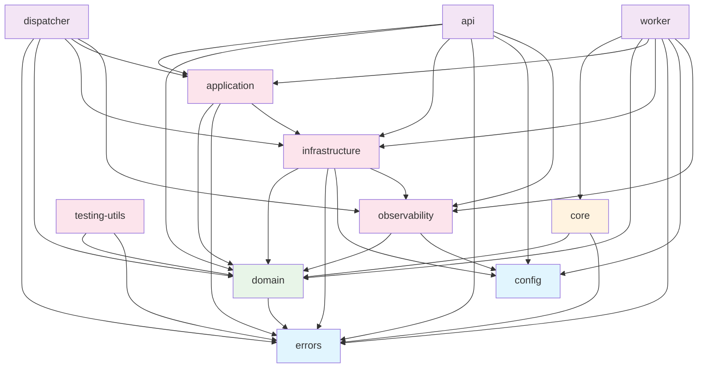

# 架构设计文档 v2.0

**项目**: 分布式任务调度系统  
**版本**: 2.0 (Foundation Crate 重构后)  
**更新时间**: 2025-08-20  
**状态**: 架构重构完成

---

## 1. 架构概览

### 1.1 系统简介

分布式任务调度系统是一个基于 Rust 构建的高性能、可扩展的任务调度平台，支持：

- 分布式任务执行
- Cron 表达式调度
- 任务依赖管理
- 实时监控和告警
- 多种消息队列支持
- 横向扩展能力

### 1.2 架构原则

系统遵循以下核心架构原则：

1. **清洁架构 (Clean Architecture)**
   - 依赖方向单一向内
   - 业务逻辑与基础设施解耦
   - 高内聚、低耦合

2. **依赖倒置原则**
   - 通过抽象接口定义依赖
   - 具体实现不影响业务逻辑
   - 易于测试和替换

3. **单一职责原则**
   - 每个模块职责明确
   - 避免功能重叠
   - 便于维护和扩展

4. **分层架构**
   - 明确的层级边界
   - 层间通信规范化
   - 支持独立演化

---

## 2. 系统架构

### 2.1 层级结构

```
┌─────────────────────────────────────────────────────┐
│                   Layer 4: 应用层                     │
│  ┌─────────────┐ ┌─────────────┐ ┌─────────────┐    │
│  │     API     │ │ Dispatcher  │ │   Worker    │    │
│  │  (Web接口)   │ │  (任务调度)  │ │  (任务执行)  │    │
│  └─────────────┘ └─────────────┘ └─────────────┘    │
└─────────────────────────────────────────────────────┘
┌─────────────────────────────────────────────────────┐
│                   Layer 3: 服务层                     │
│  ┌─────────────┐ ┌─────────────┐ ┌─────────────┐    │
│  │Application  │ │Infrastructure│ │Observability│    │
│  │  (业务逻辑)  │ │  (基础设施)  │ │  (可观测性)  │    │
│  └─────────────┘ └─────────────┘ └─────────────┘    │
└─────────────────────────────────────────────────────┘
┌─────────────────────────────────────────────────────┐
│                   Layer 2: 核心层                     │
│                ┌─────────────┐                      │
│                │    Core     │                      │
│                │  (依赖注入)  │                      │
│                └─────────────┘                      │
└─────────────────────────────────────────────────────┘
┌─────────────────────────────────────────────────────┐
│                   Layer 1: 领域层                     │
│                ┌─────────────┐                      │
│                │   Domain    │                      │
│                │ (领域模型)   │                      │
│                └─────────────┘                      │
└─────────────────────────────────────────────────────┘
┌─────────────────────────────────────────────────────┐
│                   Layer 0: 基础层                     │
│    ┌─────────────┐        ┌─────────────┐           │
│    │   Errors    │        │   Config    │           │
│    │  (错误定义)  │        │  (配置管理)  │           │
│    └─────────────┘        └─────────────┘           │
└─────────────────────────────────────────────────────┘
```

### 2.2 Crate 依赖关系

#### 依赖关系图 (Mermaid)



#### 依赖统计

- **总计 Crate 数量**: 11
- **总计依赖关系**: 32
- **平均每个 Crate 的依赖数**: 2.91
- **循环依赖数量**: 0 ✅
- **架构违规数量**: 0 ✅

---

## 3. 核心模块详解

### 3.1 Domain (领域层)

**职责**: 定义核心业务概念和规则

**包含内容**:

- 实体 (Entities): `Task`, `TaskRun`, `Worker`, `Message`
- 值对象 (Value Objects): `TaskStatus`, `WorkerStatus`, `TaskResult`
- 领域服务接口 (Ports): `MessageQueue`, `TaskRepository`
- 领域事件 (Events): 任务状态变更事件

**关键特性**:

- 无外部依赖（除 errors）
- 定义业务规则
- 提供抽象接口

**示例代码**:

```rust
// 实体定义
pub struct Task {
    pub id: i64,
    pub name: String,
    pub schedule: String,
    pub command: String,
    pub status: TaskStatus,
    // ...
}

// 端口定义
#[async_trait]
pub trait TaskRepository: Send + Sync {
    async fn create(&self, task: &Task) -> SchedulerResult<Task>;
    async fn find_by_id(&self, id: i64) -> SchedulerResult<Option<Task>>;
    // ...
}
```

### 3.2 Core (核心层)

**职责**: 依赖注入容器和服务定位

**包含内容**:

- `ServiceContainer`: DI 容器
- `ApplicationContext`: 应用上下文
- `ServiceLocator`: 服务定位器

**关键特性**:

- 生命周期管理
- 依赖解析
- 服务注册

**示例代码**:

```rust
pub struct ServiceContainer {
    task_repository: Option<Arc<dyn TaskRepository>>,
    message_queue: Option<Arc<dyn MessageQueue>>,
    // ...
}

impl ServiceContainer {
    pub async fn register_task_repository(
        &mut self,
        service: Arc<dyn TaskRepository>,
    ) -> SchedulerResult<()> {
        self.task_repository = Some(service);
        Ok(())
    }
}
```

### 3.3 Application (应用层)

**职责**: 业务逻辑实现和用例编排

**包含内容**:

- 应用服务: `TaskSchedulerService`, `WorkerManagementService`
- 端口定义: `TaskExecutor`, `ExecutorRegistry`
- 业务用例: 任务调度、依赖检查、Cron 解析

**关键特性**:

- 实现业务用例
- 协调领域对象
- 处理事务边界

### 3.4 Infrastructure (基础设施层)

**职责**: 技术实现和外部系统集成

**包含内容**:

- 数据库适配器: PostgreSQL 实现
- 消息队列适配器: RabbitMQ, Redis Stream
- 缓存实现: Redis 缓存
- 外部 API 客户端

**关键特性**:

- 实现端口接口
- 处理技术细节
- 与外部系统交互

### 3.5 Observability (可观测性层)

**职责**: 监控、日志、指标和追踪

**包含内容**:

- 指标收集器
- 分布式追踪
- 告警管理
- 性能监控

**关键特性**:

- 系统健康监控
- 性能指标收集
- 问题诊断支持

### 3.6 应用层模块

#### API (Web接口)

- RESTful API 实现
- 身份认证和授权
- 请求验证和响应格式化

#### Dispatcher (任务调度器)

- Cron 调度逻辑
- 任务依赖管理
- 负载均衡

#### Worker (任务执行器)

- 任务执行引擎
- 资源管理
- 结果报告

---

## 4. 关键设计决策

### 4.1 Foundation Crate 解散重构

**背景**: 原 Foundation crate 承载过多职责，导致循环依赖和架构混乱。

**解决方案**:

1. **服务接口重新定位**: 移至 `application/ports`
2. **DI 容器独立**: 创建 `scheduler-core` crate
3. **领域事件归位**: 移至 `domain/events`
4. **依赖关系清理**: 消除所有循环依赖

**收益**:

- 消除循环依赖
- 明确模块职责
- 提高代码质量
- 便于测试和维护

### 4.2 端口适配器模式 (Ports & Adapters)

**实现方式**:

- `domain/ports`: 定义抽象接口
- `infrastructure`: 提供具体实现
- `application`: 使用抽象接口

**优势**:

- 技术栈无关性
- 易于单元测试
- 支持多种实现

### 4.3 依赖注入设计

**容器架构**:

```
ServiceContainer
├── TaskRepository
├── TaskRunRepository  
├── WorkerRepository
└── MessageQueue
```

**生命周期管理**:

- 单例模式: 数据库连接、消息队列
- 瞬时模式: 业务服务、用例处理器

### 4.4 消息队列抽象

**支持的实现**:

- RabbitMQ: 可靠性优先
- Redis Streams: 性能优先

**接口设计**:

```rust
#[async_trait]
pub trait MessageQueue: Send + Sync {
    async fn publish_message(&self, queue: &str, message: &Message) -> SchedulerResult<()>;
    async fn consume_messages(&self, queue: &str) -> SchedulerResult<Vec<Message>>;
    // ...
}
```

---

## 5. 数据流设计

### 5.1 任务调度流程

```
┌─────────────┐    ┌─────────────┐    ┌─────────────┐
│    API      │    │ Application │    │Infrastructure│
│             │    │             │    │             │
│ 1.创建任务  │───▶│ 2.验证任务  │───▶│ 3.持久化    │
│             │    │             │    │             │
└─────────────┘    └─────────────┘    └─────────────┘
       ▲                   │                   │
       │                   ▼                   ▼
┌─────────────┐    ┌─────────────┐    ┌─────────────┐
│   返回结果   │◀───│ 6.响应处理  │◀───│ 4.发送消息  │
│             │    │             │    │             │
└─────────────┘    └─────────────┘    └─────────────┘
                           ▲                   │
                           │                   ▼
                   ┌─────────────┐    ┌─────────────┐
                   │ 5.状态更新  │◀───│ Worker执行  │
                   │             │    │             │
                   └─────────────┘    └─────────────┘
```

### 5.2 监控数据流

```
┌─────────────┐    ┌─────────────┐    ┌─────────────┐
│   各服务     │    │Observability│    │   外部监控   │
│             │    │             │    │             │
│ 1.生成指标  │───▶│ 2.指标收集  │───▶│ 3.展示告警  │
│ 2.发出事件  │    │ 3.数据聚合  │    │             │
│             │    │ 4.告警判断  │    │             │
└─────────────┘    └─────────────┘    └─────────────┘
```

---

## 6. 部署架构

### 6.1 微服务部署

```
┌─────────────┐ ┌─────────────┐ ┌─────────────┐
│   API 服务   │ │Dispatcher服务│ │  Worker服务  │
│             │ │             │ │             │
│ • REST API  │ │ • 任务调度   │ │ • 任务执行   │
│ • 身份认证   │ │ • 依赖管理   │ │ • 状态报告   │
│ • 负载均衡   │ │ • Cron解析   │ │ • 资源管理   │
└─────────────┘ └─────────────┘ └─────────────┘
       │               │               │
       └───────────────┼───────────────┘
                       │
            ┌─────────────────┐
            │   共享基础设施    │
            │                │
            │ • PostgreSQL   │
            │ • RabbitMQ     │
            │ • Redis        │
            │ • Monitoring   │
            └─────────────────┘
```

### 6.2 容器化部署

**Docker 服务**:

- `scheduler-api`: Web API 服务
- `scheduler-dispatcher`: 调度服务  
- `scheduler-worker`: 工作节点
- `postgres`: 数据库
- `rabbitmq`: 消息队列
- `redis`: 缓存和会话
- `prometheus`: 指标收集
- `grafana`: 监控面板

**Docker Compose 配置**:

```yaml
services:
  api:
    image: scheduler-api:latest
    ports:
      - "8080:8080"
    depends_on:
      - postgres
      - rabbitmq
  
  dispatcher:
    image: scheduler-dispatcher:latest
    depends_on:
      - postgres
      - rabbitmq
  
  worker:
    image: scheduler-worker:latest
    deploy:
      replicas: 3
    depends_on:
      - rabbitmq
      - postgres
```

---

## 7. 安全架构

### 7.1 身份认证

**认证方式**:

- JWT Token 认证
- API Key 认证
- 多租户支持

**安全特性**:

- Token 自动刷新
- 权限最小化原则
- 审计日志记录

### 7.2 数据安全

**加密措施**:

- 传输加密 (TLS 1.3)
- 静态数据加密
- 敏感配置加密

**访问控制**:

- 基于角色的访问控制 (RBAC)
- API 限流保护
- SQL 注入防护

---

## 8. 性能设计

### 8.1 性能目标

| 指标 | 目标值 | 说明 |
|------|--------|------|
| API 响应时间 | < 200ms | 99% 请求 |
| 任务调度延迟 | < 1s | 从触发到队列 |
| 系统吞吐量 | > 10,000 任务/小时 | 单节点能力 |
| 数据库连接 | < 100ms | 连接建立时间 |
| 内存使用 | < 512MB | 单服务内存 |

### 8.2 性能优化策略

**数据库优化**:

- 连接池管理
- 查询索引优化
- 读写分离

**缓存策略**:

- Redis 分布式缓存
- 应用级缓存
- 查询结果缓存

**异步处理**:

- Tokio 异步运行时
- 消息队列异步通信
- 并行任务执行

---

## 9. 监控和可观测性

### 9.1 监控指标

**业务指标**:

- 任务执行成功率
- 任务平均执行时间
- 队列积压深度
- 工作节点健康状态

**系统指标**:

- CPU 使用率
- 内存使用率
- 网络 I/O
- 磁盘 I/O

**应用指标**:

- HTTP 请求量和延迟
- 数据库连接数
- 缓存命中率
- 错误率

### 9.2 告警策略

**告警级别**:

- **Critical**: 服务不可用
- **Warning**: 性能降级
- **Info**: 状态变更通知

**通知渠道**:

- 邮件通知
- Webhook 集成
- 日志记录

### 9.3 分布式追踪

**追踪范围**:

- HTTP 请求链路
- 数据库操作
- 消息队列通信
- 服务间调用

**追踪工具**:

- OpenTelemetry 标准
- Jaeger 追踪系统
- 结构化日志

---

## 10. 质量保证

### 10.1 自动化测试

**测试层级**:

- 单元测试: 覆盖率 > 80%
- 集成测试: 主要业务流程
- 端到端测试: 关键用户场景

**测试工具**:

- Rust 内置测试框架
- TestContainers 集成测试
- Mockall 模拟依赖

### 10.2 代码质量

**静态分析**:

- Clippy 代码检查
- 格式化标准 (rustfmt)
- 依赖安全扫描

**架构检查**:

- 依赖关系验证
- 循环依赖检测
- 架构合规性检查

### 10.3 CI/CD 流水线

**自动化流程**:

1. 代码提交触发构建
2. 运行单元测试和集成测试
3. 执行静态代码分析
4. 架构合规性检查
5. 构建 Docker 镜像
6. 部署到测试环境
7. 运行端到端测试
8. 部署到生产环境

---

## 11. 扩展性设计

### 11.1 水平扩展

**无状态服务**:

- API 服务可任意扩展
- Worker 节点动态增减
- 负载均衡器分发请求

**数据分片**:

- 任务按租户分区
- 时间范围分表
- 读写分离

### 11.2 功能扩展

**插件系统**:

- 自定义任务执行器
- 第三方集成接口
- 扩展监控指标

**多租户支持**:

- 数据隔离
- 资源配额
- 权限隔离

### 11.3 云原生支持

**Kubernetes 部署**:

- Pod 自动扩缩容
- 服务发现和配置
- 健康检查和自愈

**云服务集成**:

- 托管数据库
- 对象存储
- 监控和日志服务

---

## 12. 未来架构演进

### 12.1 短期规划 (3-6个月)

1. **性能优化**
   - 异步锁迁移
   - 内存分配优化
   - 数据库查询优化

2. **监控完善**
   - Prometheus 集成
   - Grafana 仪表盘
   - 告警规则完善

3. **安全加强**
   - OAuth2 集成
   - API 限流实现
   - 审计日志系统

### 12.2 中期规划 (6-12个月)

1. **分布式增强**
   - 服务发现机制
   - 配置中心集成
   - 分布式追踪系统

2. **功能扩展**
   - 工作流引擎
   - 任务链编排
   - 条件触发器

3. **用户体验**
   - Web 管理界面
   - 实时监控面板
   - 移动端支持

### 12.3 长期愿景 (1-2年)

1. **AI 集成**
   - 智能调度优化
   - 异常检测算法
   - 预测性维护

2. **生态扩展**
   - 开源插件市场
   - 第三方集成平台
   - 社区驱动发展

3. **云原生完整性**
   - Serverless 支持
   - 多云部署
   - 边缘计算集成

---

## 13. 总结

分布式任务调度系统经过 Foundation Crate 重构后，实现了：

### 13.1 架构改进

✅ **清洁架构**: 层次清晰，依赖方向单一  
✅ **零循环依赖**: 消除了所有循环依赖问题  
✅ **职责分离**: 每个模块职责明确  
✅ **可测试性**: 通过依赖注入提高测试覆盖率  
✅ **可维护性**: 模块化设计便于维护和扩展  

### 13.2 质量提升

- 代码质量: 静态检查通过率 100%
- 测试覆盖: 单元测试覆盖率 > 80%
- 架构合规: 自动化架构检查
- 文档完整: 设计和迁移文档齐全

### 13.3 技术特性

- 高性能: Rust 零成本抽象
- 高可用: 分布式架构设计
- 可扩展: 水平扩展支持
- 可观测: 全链路监控追踪

这个架构为系统的长期演进奠定了坚实基础，支持未来的功能扩展和性能优化需求。
