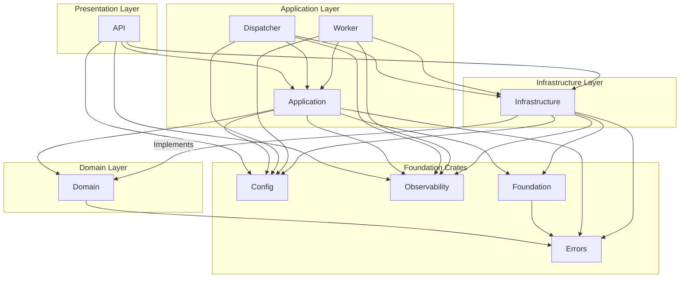

### **总体评价 (Overall Assessment)**

这是一个设计精良、结构清晰的分布式任务调度系统。项目遵循了现代 Rust 开发的最佳实践，采用了多 Crate 工作区来划分模块，实现了清晰的关注点分离。其架构深受领域驱动设计（DDD）和整洁架构（Clean Architecture）/六边形架构（Hexagonal Architecture）思想的影响，这为系统的可维护性、可测试性和未来扩展性奠定了坚实的基础。

代码整体质量很高，测试覆盖意识强，并且考虑到了可观测性、配置管理和容器化部署等生产环境要素。这是一个非常有潜力的企业级项目。我的建议旨在将这个已经很优秀的项目提升到一个新的高度，使其更具弹性、可扩展性和健壮性。

### **核心优势 (Core Strengths)**

1. **清晰的层次化架构**：项目通过 `domain`, `application`, `infrastructure` 等 Crate 完美地实现了关注点分离。领域逻辑与基础设施实现解耦得非常好。
2. **强大的基础设施抽象**：`infrastructure` Crate 中的 `DatabaseManager` 是一个亮点，它能根据连接字符串自动切换 PostgreSQL 和 SQLite 后端，完美体现了依赖倒置原则，极大地简化了开发和测试。
3. **优秀的测试策略**：拥有专门的 `testing-utils` Crate，提供了 Mock 实现和测试数据构建器（Builders），这对于编写高质量的单元测试和集成测试至关重要。
4. **生产级考量**：项目包含了数据库迁移、详细的文档、Docker/Docker Compose 配置以及 Prometheus 监控配置，表明项目从一开始就为生产环境做好了准备。
5. **消息队列解耦**：通过 `MessageQueue` trait 抽象了消息队列，并提供了 RabbitMQ 和 Redis Stream 两种实现，增强了系统的灵活性。`MessageQueueFactory` 和 `MessageQueueManager` 的设计使得切换实现变得容易。

---

### **架构与设计优化建议 (Architectural & Design Recommendations)**

尽管整体架构非常出色，但在 Crate 之间的职责划分上仍有优化的空间，这能让架构意图更加明确，并遵循更严格的依赖关系规则。

#### **建议 1：重构 `core` 和 `application` Crate，明确职责边界**

**问题分析**：
目前，`scheduler-core` Crate 承担了过多的角色。它不仅包含了真正的核心定义（如配置模型、日志），还包含了本应属于应用层的服务接口（`TaskControlService`, `TaskSchedulerService` 等）。这导致了几个问题：

* **依赖关系模糊**：理论上，应用层（`application`）应该依赖领域层（`domain`），而 `core` 作为一个更底层的模块，却定义了应用层的接口。这使得依赖关系不够清晰，未来可能导致循环依赖。
* **职责不单一**：`core` Crate 成了一个“公共杂物箱”（common crate），违反了单一职责原则。

**重构方案**：

1. **将应用层接口移至 `application` Crate**：
    * 将 `crates/core/src/traits/scheduler.rs` 文件的内容（`TaskControlService`, `TaskSchedulerService` 等应用服务接口）移动到 `crates/application/src/interfaces/service_interfaces.rs` 中。
    * `application` Crate 应该定义应用的用例（Use Cases），这些服务接口正是用例的体现。

2. **将 `core` Crate 拆分为更专注的 Crate**：
    * **创建 `scheduler-config` Crate**：将 `crates/core/src/config` 目录的全部内容移动到这个新的 Crate 中。这个 Crate 将专门负责所有配置的加载、解析和验证。
    * **创建 `scheduler-observability` Crate**：将 `crates/core/src/logging` 和 `crates/infrastructure/src/observability` 的部分内容（如 `MetricsCollector` 的定义）合并到一个新的可观测性 Crate。这个 Crate 可以提供结构化日志、事件跟踪、指标收集的统一接口和实现。
    * **重命名 `scheduler-core` 为 `scheduler-foundation`**：剩下的部分（如 `circuit_breaker.rs`, `container.rs`, `executor_registry.rs`）可以保留在一个更通用的基础 Crate 中，或者进一步拆分。

**重构后的依赖关系**：



**优势**：

* **依赖规则清晰**：严格遵循外部层依赖内部层的原则。
* **高内聚**：每个 Crate 的职责更加单一和明确。
* **易于替换**：例如，未来可以更容易地替换整个配置或日志系统。

#### **建议 2：统一和增强 `Executor` 体系**

**问题分析**：
`worker/src/executors.rs` 中硬编码了 `ShellExecutor` 和 `HttpExecutor`。虽然 `ExecutorRegistry` 提供了一定的动态性，但执行器的发现和配置是静态的。

**优化方案**：

1. **配置驱动的执行器加载**：
    在配置文件中定义要启用的执行器及其配置。

    ```toml
    # config/worker.toml
    [worker]
    # ...
    
    [[worker.executors]]
    name = "shell"
    enabled = true
    
    [[worker.executors]]
    name = "http"
    enabled = true
    
    [[worker.executors]]
    name = "python_script"
    enabled = false # 可以禁用
    type = "shell" # 复用shell执行器
    config = { command = "python" }
    ```

2. **创建 `ExecutorFactory`**：
    在 `worker` Crate 中创建一个 `ExecutorFactory`，它根据配置来实例化和注册执行器到 `ExecutorRegistry` 中。这使得添加新的执行器无需修改 `WorkerService` 的启动代码。

**优势**：

* **高可扩展性**：添加新的任务类型只需实现 `TaskExecutor` trait 并更新配置即可，无需重新编译 `worker` Crate（如果是动态加载插件的话）或修改其核心逻辑。
* **灵活性**：可以为同一执行器类型创建多个不同配置的实例（例如，不同版本的 Python）。

---

### **代码层面优化建议 (Code-Level Recommendations)**

1. **性能优化：并行化任务扫描**
    * **位置**：`crates/dispatcher/src/scheduler.rs` -> `TaskScheduler::scan_and_schedule`
    * **问题**：该函数通过循环 `for task in active_tasks` 串行处理每个任务的调度检查。当任务数量巨大时，这会成为性能瓶颈，拉长调度周期。
    * **方案**：使用 `futures::stream` 并行处理。

        ```rust
        // 伪代码重构
        use futures::{stream, StreamExt};
        
        // ... in scan_and_schedule ...
        let scheduled_runs_futures = active_tasks.into_iter().map(|task| async {
            let task_span = TaskTracer::schedule_task_span(task.id, &task.name, &task.task_type);
            let _task_guard = task_span.enter();

            match self.schedule_task_if_needed(&task).await {
                Ok(Some(task_run)) => {
                    StructuredLogger::log_task_scheduled(
                        task.id,
                        &task.name,
                        &task.task_type,
                        task_run.scheduled_at,
                    );
                    Some(task_run)
                }
                Ok(None) => None,
                Err(e) => {
                    StructuredLogger::log_system_error("dispatcher", "schedule_task", &e);
                    TaskTracer::record_error(&e);
                    None
                }
            }
        });

        // 使用 buffer_unordered 并行执行检查，并发数可配置
        let scheduled_runs: Vec<TaskRun> = stream::iter(scheduled_runs_futures)
            .buffer_unordered(self.config.dispatcher.max_concurrent_dispatches) // 使用配置的并发数
            .filter_map(|opt_run| async { opt_run })
            .collect()
            .await;
        ```

    * **优势**：显著缩短调度周期，提高调度器的吞吐能力。

2. **代码复用：统一数据库行到实体的映射逻辑**
    * **位置**：
        * `crates/infrastructure/src/database/postgres/postgres_task_repository.rs`
        * `crates/infrastructure/src/database/sqlite/sqlite_task_repository.rs`
        * 以及其他 repository 实现。
    * **问题**：`row_to_task`、`row_to_task_run` 等函数在 PostgreSQL 和 SQLite 的实现中存在重复。虽然 `sqlx` 的 `Row` 类型不同导致不能直接复用，但映射逻辑是相同的。
    * **方案**：使用 `sqlx::FromRow` trait。

        ```rust
        // 在 domain/src/entities/task.rs 中
        use sqlx::FromRow;
        
        #[derive(Debug, Clone, Serialize, Deserialize, FromRow)] // 添加 FromRow
        pub struct Task {
            // ... 字段需要与SQL查询的列名匹配
            // 对于复杂类型如 JSON 或数组，需要手动实现或调整
        }

        // 在 repository 实现中
        let task: Task = sqlx::query_as("SELECT ...")
            .fetch_one(&self.pool)
            .await?;
        ```

        对于需要特殊处理的字段（如 `dependencies` JSON 字符串转 `Vec<i64>`），可以创建一个通用的转换层结构体或 trait。
    * **优势**：减少代码重复，符合 DRY 原则。当实体结构变化时，只需在一个地方更新映射逻辑。

3. **增强错误处理：添加更多上下文**
    * **问题**：当前错误处理虽然统一，但在某些地方可以提供更多上下文来帮助调试。例如，`SchedulerError::Database(#[from] sqlx::Error)` 会丢失操作的具体信息（例如，“在更新任务 #123 时失败”）。
    * **方案**：在 Repository 实现中使用 `anyhow::Context` 来包装错误。

        ```rust
        // 在 crates/infrastructure/src/database/postgres/postgres_task_repository.rs
        use anyhow::Context;

        async fn update(&self, task: &Task) -> SchedulerResult<()> {
            // ...
            sqlx::query(...)
                .execute(&self.pool)
                .await
                .context(format!("Failed to update task with id {}", task.id))? // 添加上下文
                .map_err(SchedulerError::Database)?;
            // ...
        }
        ```

        同时，调整 `SchedulerError::Database` 的定义，使其可以存储更多上下文信息。
    * **优势**：日志和错误信息将更具可读性，能更快地定位问题。

4. **API 健壮性：在 `UpdateTaskRequest` 中区分 `null` 和 `undefined`**
    * **位置**：`crates/api/src/handlers/tasks.rs` -> `UpdateTaskRequest`
    * **问题**：`UpdateTaskRequest` 中的字段都是 `Option<T>`。这意味着客户端如果不传某个字段，它就是 `None`，表示不更新。但如果客户端想把一个字段（如 `schedule`）设置为空值（`null`），当前的 `Option<String>` 无法区分这两种情况。
    * **方案**：使用 `Option<Option<T>>` 或一个自定义的 `UpdateValue<T>` 枚举。

        ```rust
        #[derive(Deserialize)]
        pub enum UpdateValue<T> {
            Set(T),
            Unset, // 或 Null
        }
        
        // 在 UpdateTaskRequest 中
        pub schedule: Option<UpdateValue<String>>,

        // 在 handler 中
        if let Some(update_val) = request.schedule {
            match update_val {
                UpdateValue::Set(new_schedule) => task.schedule = Some(new_schedule),
                UpdateValue::Unset => task.schedule = None,
            }
        }
        ```

        一个更简单的替代方案是使用 `serde_json::Value`，但这会牺牲一些类型安全。对于大多数情况，客户端可以发送一个空字符串来表示清除，但这需要API文档明确说明。
    * **优势**：API 行为更精确，符合 PATCH 请求的语义。

---

### **重构实施路线图 (Refactoring Roadmap)**

建议按以下步骤进行重构，以降低风险并逐步改进系统。

1. **阶段一：代码级优化（低风险）**
    * [ ] **(1 week)** 应用 `anyhow::Context` 增强所有 Repository 实现中的错误处理。
    * [ ] **(1 week)** 使用 `sqlx::FromRow` 或共享的映射逻辑重构 `row_to_*` 函数，减少重复代码。
    * [ ] **(2 days)** 对 `TaskScheduler::scan_and_schedule` 进行并行化改造，并进行基准测试验证性能提升。

2. **阶段二：核心架构重构（高收益，中等风险）**
    * [ ] **(1 week)** 创建 `scheduler-config` Crate，并将 `core/config` 移入。更新所有依赖 `core::config` 的地方。
    * [ ] **(2 weeks)** **核心步骤**：将 `core/traits` 中的应用服务接口移动到 `application/interfaces`。调整 `core` 和 `application` 之间的依赖关系。这会涉及大量编译错误的修复，是本次重构的关键。
    * [ ] **(1 week)** 重命名 `scheduler-core` 为 `scheduler-foundation`（或类似名称），并清理其职责。
    * [ ] **(1 week)** 实现配置驱动的 `Executor` 加载机制。

3. **阶段三：功能增强（基于新架构）**
    * [ ] **(Sprint)** 基于新的可观测性 Crate，引入分布式追踪，并将追踪上下文通过消息队列传递。
    * [ ] **(Sprint)** 增强 API，支持更精细的 PATCH 操作。

### **总结 (Conclusion)**

该项目已经是一个非常优秀的 Rust 应用范例。它成功地运用了现代软件工程的最佳实践。上述建议旨在通过进一步明确模块边界、提升性能和增强可扩展性，将其从一个高质量的项目提升为一个真正世界级的、极具弹性和可维护性的企业级系统。实施这些重构将使项目在面对未来更复杂的需求时，依然能够保持清晰和高效。
